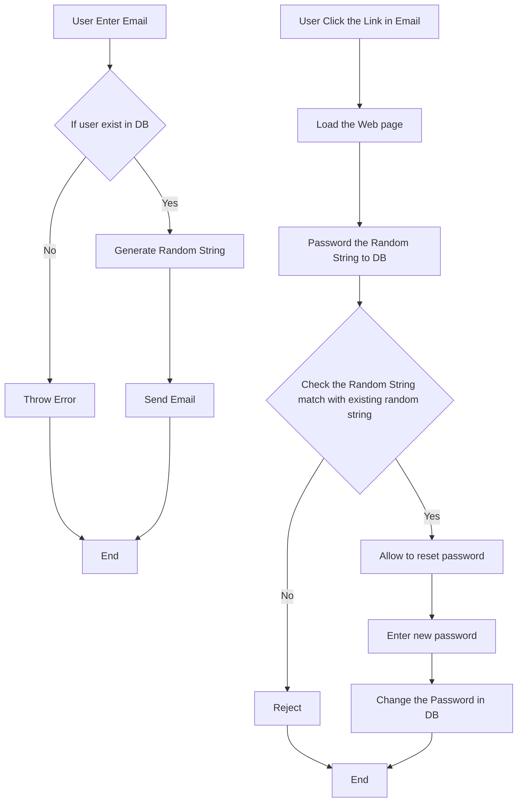

# Password Reset Application

## Overview

A secure password reset system implementation using the MERN stack (MongoDB, Express.js, React.js, Node.js) with email verification functionality. This application provides a robust solution for users to safely reset their passwords through email verification.

## Diagram of the Project Workflow


## 🚀 Features

- **Secure Password Reset Flow**
  - Email verification
  - Time-limited reset tokens
  - Secure password storage
- **Responsive UI** using Bootstrap
- **Real-time Validation**
- **Secure Backend** implementation
- **Email Integration** using Nodemailer

## 🛠️ Technical Stack

### Frontend

- React.js
- Bootstrap 5
- Axios for API calls
- React Router for navigation

### Backend

- [Node.js](https://nodejs.org/en/)
- [Express.js](https://expressjs.com/)
- [MongoDB](https://www.mongodb.com) (with [Mongoose](https://mongoosejs.com/) for ORM)
- [Nodemailer](https://nodemailer.com/) for email services
- [JWT](https://jwt.io/) for token management
- [Crypto](https://nodejs.org/api/crypto.html) for token generation
- [Bcrypt](https://www.npmjs.com/package/bcrypt) for password hashing


## 📋 Prerequisites

- Node.js v14.x or later
- MongoDB
- npm or yarn package manager
- Valid email service credentials

## 🔧 Installation

1. **Clone the repository**

```bash
git clone https://github.com/yourusername/password-reset
cd password-reset
```

2. **Install Backend Dependencies**

```bash
cd server
npm install
```

3. **Install Frontend Dependencies**

```bash
cd client
npm install
```

4. **Environment Setup**

Create `.env` file in server directory:

```env
MONGODB_URI=your_mongodb_connection_string
JWT_SECRET=your_jwt_secret_key
EMAIL_SERVICE=your_email_service
EMAIL_USER=your_email
EMAIL_PASS=your_email_password
CLIENT_URL=http://localhost:3000
PORT=5000
```

## 🚀 Running the Application

1. **Start Backend Server**

```bash
cd server
npm start
```

2. **Start Frontend Development Server**

```bash
cd client
npm start
```

## 📱 API Endpoints

### Password Reset Flow

- `POST /api/auth/forgot-password` - Initiate password reset
- `POST /api/auth/reset-password` - Complete password reset
- `GET /api/auth/verify-token` - Verify reset token

## 🔒 Security Features

- Password hashing using bcrypt
- JWT for secure token generation
- Token expiration
- Email verification
- Input validation and sanitization

## 📦 Project Structure

```
password-reset/
├── client/
│   ├── public/
│   ├── src/
│   │   ├── components/
│   │   ├── pages/
│   │   ├── services/
│   │   └── App.js
│   └── package.json
└── server/
    ├── config/
    ├── controllers/
    ├── models/
    ├── routes/
    ├── utils/
    ├── index.js
    └── package.json
```

## 🌟 Key Features Explained

### Password Reset Flow

1. User enters email on forgot password page
2. System verifies email existence in database
3. Generates unique reset token
4. Sends reset link via email
5. User clicks link and enters new password
6. System verifies token and updates password

### Security Measures

- Reset tokens expire after 1 hour
- Passwords are hashed before storage
- Email verification required
- Protected routes implementation

## 💻 Deployment

### Frontend Deployment (Netlify)

1. Connect to GitHub repository
2. Build settings:
   - Build command: `npm run build`
   - Publish directory: `build/`

### Backend Deployment (Render)

1. Connect to GitHub repository
2. Environment setup:
   - Node.js environment
   - Environment variables configuration
   - Build command: `npm install`
   - Start command: `npm start`

## 🤝 Contributing

1. Fork the repository
2. Create feature branch (`git checkout -b feature/YourFeature`)
3. Commit changes (`git commit -m 'Add YourFeature'`)
4. Push to branch (`git push origin feature/YourFeature`)
5. Open Pull Request

## ⚠️ Important Notes

- Ensure email service credentials are properly configured
- Keep environment variables secure
- Regularly update dependencies
- Monitor token expiration implementation
- Test thoroughly before deployment

## 📜 License

MIT License

## 🙏 Author

&copy; Tomislav Dukez 2025

